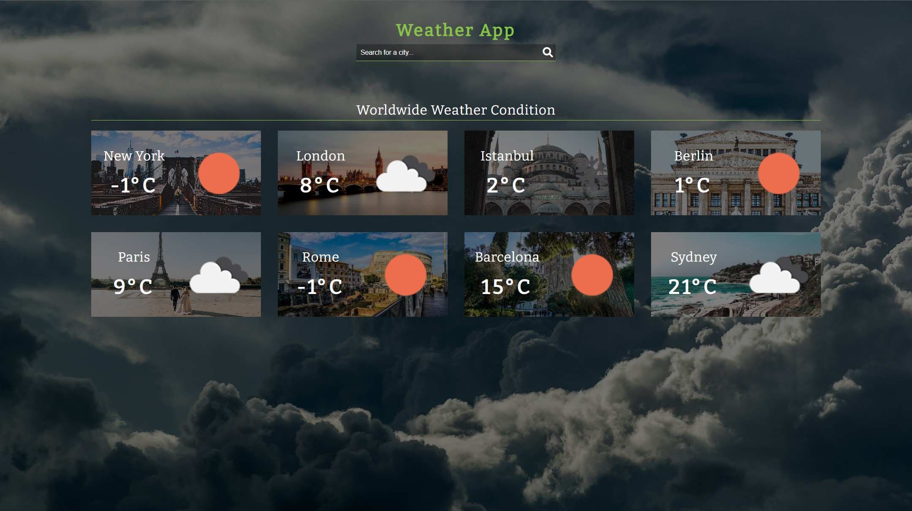
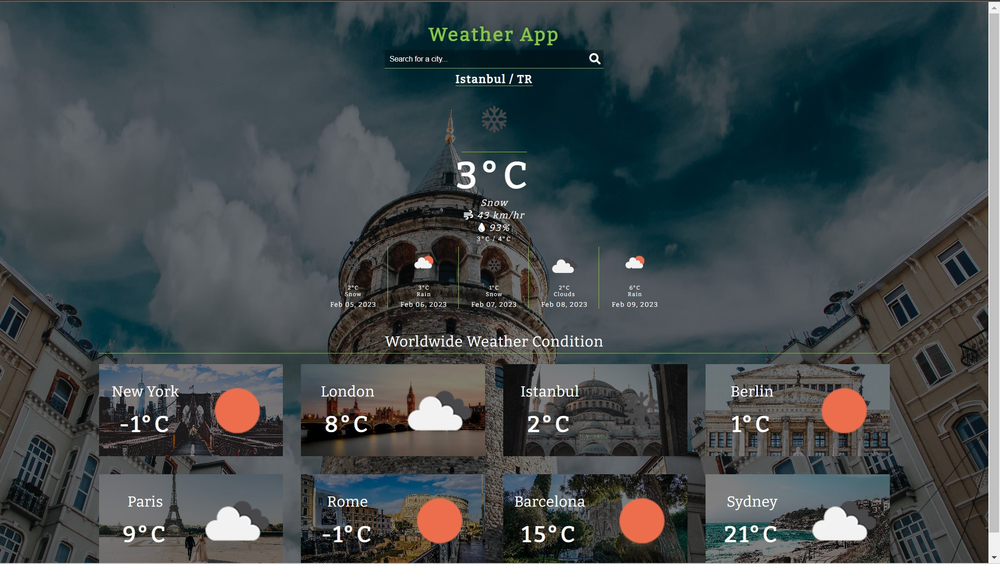

# Weather-App
It is a weather app using openweathermap api's data and images of pexels api.
It contains:
- Weather condition of a place
- Humidity percentage and wind speed at the place
- 5 day forecast

### Default view of website
</img>

- In default view, we have a header part that consists of a title and a search input to search any city we want to.
  
- Then, we have worldwide weather condition part that provides with 8 cities current weather condition. Also, there is a background image for each of 8 cities that thanks to pexels api.
  
- The site may take a while since the size of the images that are obtained from pexels api is large.

### The view of the site after a search

    </img>
    </img>

- After a search, if the user entered an invalid city the site gives an error. (first img)

- After a search, if it is a real city the site takes current weather condition data and 5 day weather forecast data of the city from openweathermap api.

- It also takes an image of the city from pexels api and makes it background image. (second img)

### Mobile view

</img>